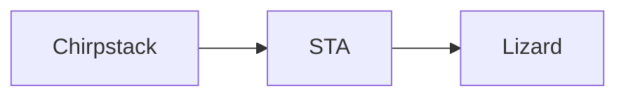

# Topic 1: Communicating with a collection of sensors

### Content
This report describes the research that is done for research topic 1 in the Geonovum Testbed Sensordata. Part of the research was making a proof of concept, which is available on:
- GitHub: [NenS sensordata-demo](https://github.com/nens/sensordata-demo)
- FROST-Server implementation of SensorThings API: [FROST-Server](https://sensordata-demo-frost.staging.lizard.net/FROST-Server/)
- Lizard data warehouse: [Lizard staging](https://nxt3.staging.lizard.net/viewer/favourites/86542561-3feb-4035-aa39-299bfc80a693)

### Scope
The implementation of sensors for measuring things in the field has grown over the years and will continue growing. It is a challenge to handle the vast amount of collected data and keep grasp on the internal relationships within the data. 

Different uses of the data require different views on them. Registration of measurements is done based on the sensor that collects them. For other purposes, e.g. for dashboards or digital twins, you are often interested in the current situation for a collection of features of interest that are measured by sensors.

It is also interesting to see how such an API standard fits to existing applications. If an existing application would have to expose its data through a new standard, what difficulties can be foreseen?

### Goal
OGC has multiple API standards that cover observations and measurements. Geonovum is interested in the applicability in the Dutch domain of two of these: OGC SensorThings API (STA) and OGC Connected Systems API (CS API). 

In this research topic the focus is on what options there are to query combinations of observations. How to store data based on a datafeed from a sensor platform and how to expose them through an API, supporting different uses.

### Use case
The municipality of Rotterdam would like to see their live sensordata exposed using standards such as SensorThings API and Connected Systems API and learn what this would mean in practice. For instance how would groundwater levels, which are derived by calculation from the raw sensordata, be exposed. How would sensors that measure multiple values (12-1 weather station) be represented. Can the sensors benefit from being exposed in an Observations Measurements and Sampling (OMS) solution?

They are also looking for a scalable and accessible solution to store their sensor data in and make it available for further use. For groundwater levels Nelen & Schuurmans Lizard data warehouse is already used as a system integrator. What role can the OGC standards play in data exchange between systems?

### Methodology
We first familiarized ourselves with the standards at hand by doing a desk study on available documentation. What concepts are used, how are datamodels designed and what is the setup of the API's?

Next, we set up a proof of concept application that makes use of the data made available by Rotterdam and process it through the API standards to our own data warehouse Lizard. By using the API we learn:

- How the mapping between sensor input and the API datamodel needs to be configured
- What query options there are in the API standard
- How API outputs can be shaped to the desired output for different use cases
- What mapping is needed to supply data from the API standard to another data platform

Unfortunately, we didn't succeed in installing the CS API, because there were technical issues with the available docker images of the 52North package. For the functional comparison with STA we used an existing implementation based on [OGC CS API Docs](https://opengeospatial.github.io/ogcapi-connected-systems/redoc/?url=../api/part2/openapi/openapi-connectedsystems-2.yaml#tag/Observations), which refers to the
[GeoRobotix OGC testbed 18 CS API](https://api.georobotix.io/ogc/t18/api).

## Comparison of OGC API standards
Although they have an overlap in underlying definitions, the two API standards have slightly different backgrounds and therefore different design choices. STA focusses on IoT devices where CS API is more generically applicable. Also, there is a difference is age. The first version of STA has been approved in 2016, while CS API is currently still in draft.

The relevant aspects for comparison for this research topic are:
- __Datamodel__: The datamodel design determines to a large extent how an API can be interacted with and how incoming data should be mapped. What entities should be configured to set up a usable system? Which entity relations are required?
- __API setup and capabilities__: How can data be retrieved? What options are available to shape the output to a desired format?

Items that are explicitly excluded from the comparison are:
- __Tasking Core/Actuators__: The research is about sensor observations and not about the capabilities to interact with sensors.
- __API extensions__: STA for instance has a [PLUS extension](https://www.opengis.net/doc/is/sensorthings-staplus/1.0). We will only consider this in the assessment of possible ways to improve the applicability of the standards.

### Datamodel

Similarities relevant to this research topic:
- Measured results are stored as Observations with Datastreams as their main grouping mechanism.
- There are entities to describe the object that is observed with/from.
- An Observation concerns a Feature of Interest.

Differences relevant to this research topic:
- The entities Sensor and Thing from STA are generalized in CS API to the entity System.
- In STA the UltimateFeatureOfInterest is only linked to the Observation. CS API also has a more direct link from the UltimateFeatureOfInterest to a Datastream, through the SamplingFeature.

### API setup and capabilities
The two standards are both based on REST, but have different capabilities when it comes to querying data and shaping responses. Our focus is on Observations, as those are most relevant to use in applications.

Relevant similarities:
-  Support for limiting the list of returned properties per object with the `select` option. This is useful to reduce the size of the response, especially for use cases in e.g dashboards.

Relevant differences:
- CS API by default returns all related entities of a requested object. STA only covers properties of the selected entity, but has options to deviate from this with `expand` to extend with related entities.
- STA supports more forms of nested filtering. This reduces the number of queries that need to be done to find the right collection of results.

## [WIP] Results from PoC

<figure id="PoC Dataflow">

<figcaption>PoC Dataflow based on SensorThings API</figcaption>
</figure>

#### Step 1: Receiving Chirpstack data
In Chirpstack an HTTP-feed can be set up, sending messages from a group of sensors to an external URL. We've set up a service that receives this feed and processes the input as log messages.

#### Step 2: Setting up FROST-server with initial configuration

#### Step 4: Processing sensor observations in STA
The Chirpstack feed consists of JSON with a couple of relevant attributes that we needed to process the Observations to 

#### Step 5: Configuring Lizard

#### Step 6: Processing observations from STA to Lizard

### [WIP] Learnings from PoC

## Conclusions
On implementability of the API standards:
- The API standards are applicable in the Dutch domain, at least as stand-alone applications. Data can be exchanged between these standards and other applications.
- Suitability depends on the purpose of an application. If it relies on information about the sensors/systems, e.g. for validation of Observations, it makes sense to use them. If not, these standards come with quite some overhead in entity relationships.
- Due to overhead in the datamodels there is a risk of scalability issues for larger data systems. There is a limit to what can be solved by clever indexes, buckets and partitioning of Observations, their different possible types of results and entity relations.
- Full support of these standards by existing data warehouse applications may be tricky due to a mismatch in mapping of entities between datamodels. It would probably require specific boundary conditions for how data is stored and metadata is configured to make either API standard applicable for both data ingestion and publication.

On communication with a collection of sensors:
- STA supports query options to expand API responses with information of related entities. This can be used for dashboarding applications to retrieve results for multiple objects.
- The accuracy of temporal queries on Observations depends on the measurement regime of a collection of sensors and the way properties like phenomenonTime and resultTime are stored. If not lined up neatly on rounded times and intervals, there is a big risk of returning multiple results per Datastream, which may be hard to deal with by the retrieving application.
- Based on documentation, CS API has one advantage over STA when it comes to querying Observations for collections of Datastreams: The filter option `latest` on phenomenonTime and resultTime. Unfortunately, in the implementation that we tested with this did only work when requesting Observations for a single Datastream, which makes it irrelevant for dashboarding.
- A mechanism like ObservationCollections makes querying groups of Observations much easier. Disadvantage is that it requires a lot of additional administration, to group Observations like that and to keep Collections up to date in time. For operational services this will likely give a lot of overhead.
