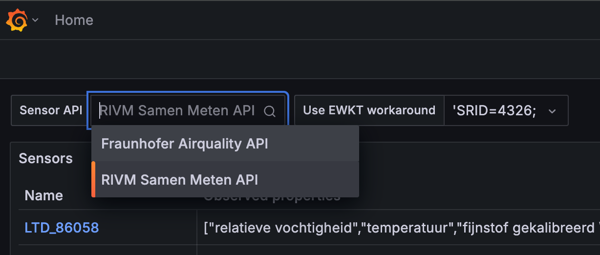
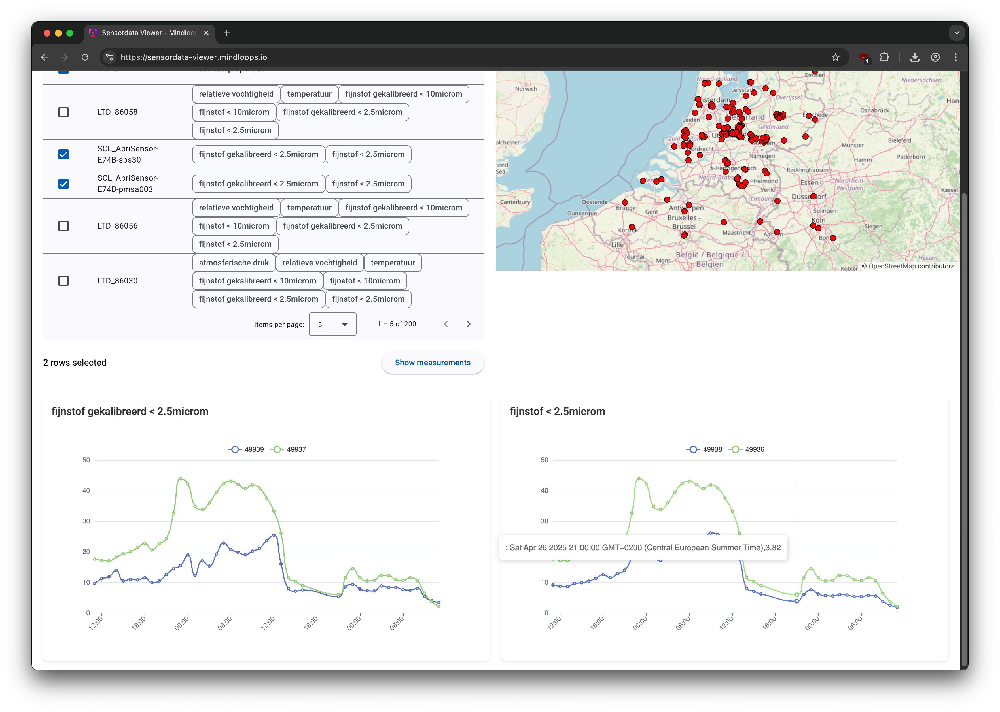

## Research question 2: Visualisation & analysis

### Goal

An important aspect of working with sensor data is, of course, being able to get the data and load it into an
application for visualisation and analysis. This research question is about demonstrating that this works,
both in a web viewer and in a dashboard application (e.g. Grafana).

Demonstrate the following steps in both types of application:
1. The user searches for and finds different sensors that offer sensor data;
2. The users selects a subset of measurements based on several criteria. The following criteria must
be demonstrated as a minimum:
- most recent measurement of one sensor;
- all measurements at a certain location within a certain time period;
- most recent measurement of a selection of sensors that are located within a bounding box.
3. The application loads the selected measurements;
4. The user can view and use the measurements within the application.

### Use case

RIVM offers an existing SensorThings API (STA) endpoint (https://api-samenmeten.rivm.nl/v1.0) which can serve input for analysis and visualization demonstrations. Further, we are interested to investigate if this endpoint offers
sufficient data and metadata detail to support connections to third party dashboards, or if (small) tweaks are required in order to enable easier integration of the offered data with other tools.

### About the researchers

This research is conducted by [Mindloops BV](https://mindloops.nl). Mindloops is a boutique software consultancy specializing in software engineering. For nearly 10 years, Mindloops has proudly delivered solutions to clients such as the Dutch Police, the Dutch Railways (NS), The Netherlands’ Cadastre, Land Registry and Mapping Agency (Kadaster) and Dutch National Road Data Portal (NDW). Together with our clients and partners, Mindloops is committed to making a positive impact on society. Mindloops has a proven track record in building and running high-quality, mission-critical, bespoke software designed to last and evolve for decades. These data-intensive systems often require extensive integration with other systems, as well as data visualization.

### Overall design and approach

The viewers communicate with a SensorThings API and allow users to select sensors and view measurements. As a data source we used the [RIVM SamenMeten SensorThings API](https://www.samenmeten.nl/international/API). To prove that our viewer is able to handle SensorThings API in a generic way we’ve also added the [Fraunhofer Airquality SensorThings API](https://airquality-frost.k8s.ilt-dmz.iosb.fraunhofer.de/v1.1/) (as a bonus).

We’ve applied a risk-driven approach in which we tackled the most complex things early on. This maximises the desired outcome within the available time. Also we used an iterative and agile approach with short feedback cycles to validate our results, which aligned with the bi-weekly meetings with GeoNovum.

### Completed features

Both viewers are delivered on a publicly accessible URL, which will be available for demonstration purposes until 31-10-2025.

- Dashboard application (Grafana): https://sensordata-dashboard.mindloops.io/
- Web viewer: https://sensordata-viewer.mindloops.io/

All source code needed to run both solutions in a local environment is delivered as open source. 
See the README in each repository for details. All source code is provided as open source under MIT license.

- Dashboard application (Grafana): https://github.com/mindloops/sensordata-dashboard
- Web viewer: https://github.com/mindloops/sensordata-web-ui

#### Demo

##### Dashboard application (Grafana)
1. Selecting a specific sensor

2. Select an area on the map and list sensor data.

3. Show measurements of sensor

4. Switch API source to use. Note: for the RIVM API the 'Use EWKT workaround' should be set on 'SRID=4326', while for the Fraunhofer API it should be empty.

##### Web viewer
1. Selecting a specific sensor

2. Select an area on the map and list sensor data.

3. Show measurements of sensor

### Findings

#### Overall

The SensorThings API (STA) provides a well-structured and easy to use API for consuming sensor data. There are several data structures in the API,
that are well interconnected and provide useful entries into a suite of sensor data. It is possible to query data in several useful ways, e.g.
based on observed properties, geo location and/or time range. Additionally, it is also possible to combine API results dynamically as part of the
OData standard that the SensorThings API is based on. This makes it possible to combine data in a single API call, even though this is not
predefined in the API specification. That is very useful, especially for more standardized tools like Grafana, 
that need all relevant data in a single API response to work properly.

We experienced no major shortcomings in the SensorThings API standard. We identified the following (minor) improvements:

1. No standard for observed properties
Currently every STA defines its own observed properties. For example temperature is (re)defined in every single STA. There are no standard observed properties. The STA specification does allow observed properties to point to definitions but every STA implementation is free to pick their own definitions. This makes it harder for example to convert from one unit of measurement to another in a viewer.

2. No support for multiple languages
Descriptions for sensors and measured properties are not available in multiple languages by the SensorThings API. This seems missing in the specification. This may make it harder to use sensor data, especially when descriptions are provided in different languages depending on sensor location.

#### RIVM
We worked with the RIVM Samenmeten API as the primary datasource for this use case. The implementation is based on 1.0 of the specification. RIVM uses the open source [GOST server](https://github.com/gost/server) which is currently not actively maintained and has several known issues. RIVM is aware of these issues and is planning to migrate to a different solution in the future.

We encountered the following issues during our research:

1. The geospatial search filter did not work with a standard WKT string. It did work with an EWKT string, which contains an SRID and is specific to the Postgres database as used by RIVM. This means geospatial search was not interoperable with other APIs like Fraunhofer’s.

2. The paging feature of the API is activated when more than 200 results are returned. However, paging did not always work properly, meaning no results were returned or the wrong results, because the "top" and "skip" values were not processed correctly. In addition, when using the "$expand" feature, paging was often not possible at all even though results were still limited to 200. This makes it impossible to process all available data. The latter is a [known issue in GOST](https://github.com/gost/server/issues/146).

3. The "in" filter, a standard part of the API, was not implemented since it isn’t supported by GOST. For example: the following query failed: https://api-samenmeten.rivm.nl/v1.0/Datastreams?$filter=id%20in%20(10208,10209).
It does complete successfully in other STA implementations (e.g. FROST): https://airquality-frost.k8s.ilt-dmz.iosb.fraunhofer.de/v1.0/Datastreams?$filter=id%20in%20(4,5,6,7) 

4. The RIVM API does not allow Cross-Origin Resource Sharing ([CORS](https://developer.mozilla.org/en-US/docs/Web/HTTP/Guides/CORS)). This makes it impossible to build a web-based viewer that communicates directly with the API (using XHR requests). Since the browser used by an end-user will enforce CORS by default. As a workaround we proxied the requests of our web-based viewer through our backend service. To be clear: this issue only applies to client-side web-applications.

#### Dashboard application

We’ve selected Grafana to implement the dashboard application since it’s the de facto application for complex time series data and well-suited to display sensor data. On the other hand Grafana is a generic dashboarding and visualisation tool, and is not specifically built for SensorThings API. As a consequence we needed to organise API calls and responses in such a way that it fits the Grafana way of working. This would also apply to other off-the-shelf visualisation tools like Kibana, Apache Superset or BI tools like PowerBI, Tableau, etc.

Our research revealed the following findings:

1. We started out with the [FROST SensorThings Datasource plugin](https://grafana.com/grafana/plugins/iosb-sensorthings-datasource/). This data source was easy to use but limited in its capabilities. It is only capable of displaying observations. We switched to the more generic [Infinity Data Source](https://grafana.com/docs/plugins/yesoreyeram-infinity-datasource/latest/) instead. This had the advantage of also being able to fetch other SensorThings endpoints like Locations, Things and ObservedProperties. We needed data from these endpoints to display maps and tables on our dashboard to allow the user to select one or more sensors. The Infinity data source is also more advanced compared to the FROST data  source as it supports other features of Grafana like alerting. Alerting is supported since it’s a so-called [Grafana backed plugin](https://grafana.com/developers/plugin-tools/key-concepts/backend-plugins).

2. To meet the requirement for the interactive map, we were unable to use the [built-in Geomap component](https://grafana.com/docs/grafana/latest/panels-visualizations/visualizations/geomap/) of Grafana since it doesn’t allow user interaction. In Grafana,
it is more common to predefine a geographic visualisation and set-up different dashboards for different locations or areas (e.g. Netherlands/Germany). So it isn’t a common use case. As an alternative we used the [GeoMap Panel WMS plugin](https://grafana.com/grafana/plugins/felixrelleum-geomapwms-panel/). Despite its name this geomap component isn't limited to WMS datasources, it supports the same datasources as the built-in Grafana geomap component like OpenStreetMap. The GeoMap Panel component worked perfectly and allows the user to draw a polygon and thereby select one or more sensors (things) on a map.

#### Bespoke web viewer

A bespoke web app allows for more freedom in customization and presenting the data visually. All components can be tailored to the SensorThings API use case. The downside is that this may require more technical expertise, and no customisation is possible by end-users.

Our research revealed the following findings:

1. On request of GeoNovum we used AI code generation tools to help assist with the generation of several parts of the viewer. The AI tools we used (Amazon, Microsoft, Google) all understood SensorThings API semantics in general and were able to provide initial implementations for them. It did require significant tuning, due to API implementation details sometimes missing or behaving differently, and AI tools not always properly providing solutions that had the right semantics. In summary, at the moment AI tools are useful for jumpstarting specific parts of the viewer, such as a table or map component, but are unlikely to provide meaningful results when tasked with creating an entire viewer from a single prompt. Still AI coding tools are very helpful and promising.

2. As mentioned in the RIVM paragraph due to the CORS limitation in RIVM API, we couldn’t connect the web viewer directly to the RIVM API. Instead, we used
an intermediate proxy on our own backend to work around this limitation.

### Conclusion

All research goals were successfully achieved for both the dashboard application and the bespoke web viewer. The Sensordata API allows for a flexible way to interconnect sensor data with
different visualisation and analytics technologies. There are some caveats, e.g. issues in API implementations, and potentially vague or missing metadata in the generic API, that makes it necessary to customize or tune the viewer based on details outside the SensorThings API.

### Recommendations
 
#### RIVM API
* Upgrade the SensorThings server to a more actively maintained implementation. This would likely resolve all encountered issues. We’ve discussed this finding with RIVM, and RIVM is already planning to upgrade the server.
* Enable CORS to allow web viewers to interact directly with the API without needing a backend. This involves including the `Access-Control-Allow-Headers: *` HTTP header in every response.

#### SensorThings standard
* Investigate ways to standardize observed properties and/or support conversions between units of measurement. For example, allow the user to specify the desired unit of temperature as Fahrenheit in a query parameter and let the API take care of Celsius to Fahrenheit conversion.
* Investigate ways to allow for internationalization (i18n). This can be achieved by supporting the `Accept-Language` HTTP request header in line with [OGC API Common](https://docs.ogc.org/is/19-072/19-072.html#_98ff4350-10c4-454e-b5da-6802f1ad70d7).

