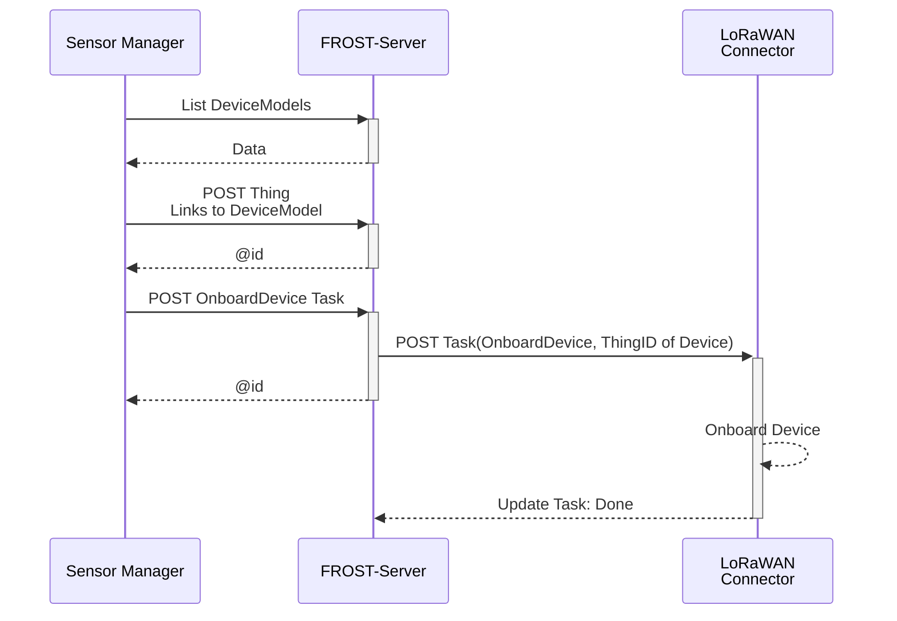
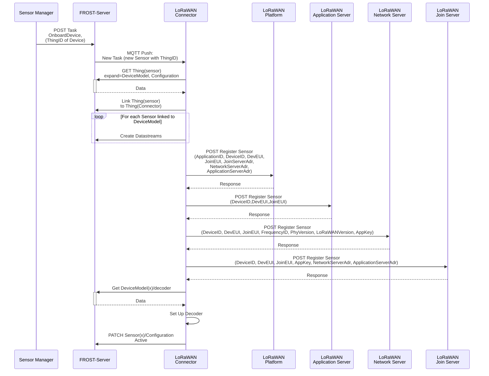

## Research question 3: Device Registration

### Goal

The OGC SensorThings API is a very convenient API for accessing sensor data.
But to access sensor data, the data has to be added to a service first.
Most sensors no not _talk_ SensorThings, but some other standard, like LoRa-WAN, NB-IoT or 5G.
What needs to happen to have a sensor be registered in a SensorThings service, and have the data from the sensor appear there too, is device registration, or onboarding.
This research topic explores the issue of device registration.


### About the researchers

This research is done by the [Fraunhofer Institute of Optronics, System Technologies and Image Exploitation IOSB](https://www.iosb.fraunhofer.de/en.html), specifically the department [Information Management and Production Control](https://www.iosb.fraunhofer.de/en/competences/system-technology/information-management-and-production-control.html) (ILT).
The department Information Management and Production Control develops open and secure architectures, software components and solutions for information, control and test systems in Internet of Things (IoT) application areas.


### State of Research

Device registration, and following that, device management, is an ongoing research topic.
Not just in the context of the Internet of Things, but everywhere where sensors are deployed and managed.
The complexity stems from the fact that there are very many different sensors and sensor types, used in very many different use cases, feeding their data into very many different sensor data management systems over many different communication protocols.
The manufacturer of a Sensor system can’t know in advance the use cases the sensor will be used for, or the sensor data management systems it will need to feed data to.

When deploying a new sensor for a given use case, communicating over an existing communication infrastructure, sending data to an existing sensor data management system, information from four different sources needs to be combined:

- The sensor hardware, such as:
  - Sensor identification
  - Measured parameters
- Communication Infrastructure, such as:
  - Authentication and Authorisation
  - Addresses of brokers or gateways
- Sensor data management system, such as:
  - Authentication and Authorisation
  - API endpoints
- Use case, such as:
  - Feature the sensor observes
  - Location of the sensor
  - Responsible party

The initial configuration of sensor devices is manufacturer specific and needs to be done directly on the device
For instance, many manufacturers of LoRaWAN sensor devices provide a smartphone app that uses Near-Field-Communication (NFC) to directly change the configuration of their devices.
Next to the initial configuration of the device itself, the device also has to be registered on the communication network.
On the case of LoRa, this is often the global network “The Things Network”, but many organisations have their own local LoRa instance using the “Chirpstack” software implementation.
Once the initial configuration is completed, and the device is connected to a LoRa network, the configuration of many devices can also be changed using Over-The-Air updates.

The sensor also has to be registered in the sensor data management system of the organisation that deploys the sensor, so that the data from the sensor can be used for the purpose it was deployed for.
There are many different systems for this, many custom-built for their use case, some based on standards such as O&M, OMS or the SensorThings API.

Because of the enormous diversity in each of the layers involved, the concept of connectors is used to transfer data between the communication infrastructure and the information management system.
A Connector is a piece of software with Extract, Transform, Load (ETL) functionality, that takes data from a source system, transforms the data into the format of the target system, and then loads the data into the target system.
A common piece of software used for this purpose is [NodeRed](https://nodered.org/), that features a browser-based, drag-and-drop interface for creating ETL flows.

One problem with this architecture is directly clear from figure 1: The data from a single sensor has to be managed and kept synchronised over multiple systems.


Taking a typical LoRa device, using NodeRed as ETL stack, the process looks something like this:

1. **Device**: Configure the device by setting the identifiers and secrets used to join the LoRa network and configure the intervals in which measurements are made.
1. **LoRa Network**: Register the device
   1. Create a device object in the LoRa network stack with the identifiers and secrets from the previous step.
   1. Set up a low-level decoder to decode the payload of the sensor into a generic JSON object.
      If multiple devices of the same type are used, this generally only needs to be done once.
1. **SensorThings Service**: Create entities for managing the sensor data
   1. Create a Thing with a Location
   1. For each Sensor on the device, create an ObservedProperty instance if a suitable one is not already present.
   1. For each Sensor on the device, create a Sensor instance if a suitable one is not already present.
   1. For each Sensor on the device, create a Datastream, linked to the Thing, a Sensor and an ObservedProperty.
1. **NodeRed**: Create the workflow that can decode the generic JSON object and insert each value into the correct Datastream for the device.


Device Registration is also only the first step in the long process of device management.
Devices can break, be moved around, and be decommissioned.
Battery lifetime needs to be tracked to ensure they are exchanged in time and sensors need to be monitored to ensure they still work as expected.
It is quite likely that the admin in the diagram will start using a spreadsheet to keep track of his sensors, thus adding a fifth location that contains data for a sensor that needs to be kept in sync.


### OpenCitySense

To make the complexities of sensor management more manageable, Fraunhofer IOSB started an internal research project to design the concept for a sensor management system, based on the OGC SensorThings API, and create an implementation of this system.

Since the [SensorThings API version 1.1](https://docs.ogc.org/is/18-088/18-088.html) is extendible by design, and already comes with several extensions, the architecture can be greatly simplified by using the SensorThings API service as the central data store for all sensor related data (figure 3).
This means that all components communicate through a single service, reducing the number of interconnects between components and reducing the spread of primary information across components.

The standard [tasking extension](https://docs.ogc.org/is/17-079r1/17-079r1.html) can be used to coordinate management actions between components, such as signalling to a connector that a sensor needs to be on-boarded, that a configuration needs to be changed, or that a sensor needs to be off-boarded.
The connector concept can then be extended to not just be a one-way ETL process, but to take an active role in the sensor registration process on the LoRaWAN stack.
It can receive information about new or updated sensors from the SensorThings service, and automatically take all required registration actions in the communication infrastructure.


Besides greatly simplifying the architecture, a second major advantage to using the SensorThing API service for all data storage is that it offers a consistent, powerful API for managing relational data.
This makes all data relevant for managing sensors and their data available in a unified, consistent way, and management tools or other clients do not need to implement multiple APIs.
While all publicly relevant sensor data and metadata can be stored in the core data model of the SensorThings API, internal management data can be stored in a custom data model extension.
Since this does not alter the core data model of the SensorThings API, clients implementing only the Sensing part will not be affected by this data model extension.

Sensor configuration parameters are modelled using the [SWE Common Data Model Encoding Standard](https://www.ogc.org/publications/standard/swecommon/), and translated by the connector into a form that the sensor understands.
This means that regardless of sensor brand or type, the management GUI can offer a consistent interface for changing sensor settings.

OpenCitySense consists of:

- A data model extension for FROST-Server.
- A GUI for managing sensors.
- A generic framework for developing connectors.
- A connector for connecting LoRaWAN devices over Chirpstack.
- A connector for connecting LoRaWAN devices over TTN/TTI.


#### Data Model

To allow the representation of device management information, a data model extension has been designed for the data models of the SensorThings API and the tasking extension.
The extended data mode is depicted in the following image.


Connectors and Devices are modelled as Things.
To make it easier to distinguish between different types of Things, a "type" field has been added to the Thing entity type that indicates the type of the thing.
Things of type "Connector" are linked to the Things of the devices they manage, through the ControlledDevices <-> ControllingConnector relation.
This makes it easy to find all the devices controlled by a certain connector, and to find the connector controlling a certain device.

Each Thing can have a DeviceModel, describing the capabilities of the Device or Connector.
A DeviceModel contains the schema for the Configurations of devices of this model, and can link to a Configuration that is the template or default configuration of devices of this model.
DeviceModels can link to a Decoder that can be used to decode and encode data coming from and sent to devices of this model.


DeviceModels link to Sensors that describe the Sensors that a device of the model has.
In turn, Sensors link to the ObservedProperties that a Sensor of this type observes.
Using these two links, a Connector knows which Datastreams to create and which Sensor and ObservedProperty to link, when onboarding a Device.


DeviceModels link to the DeviceModels of the Connectors that they are compatible with.
This allows a user interface to find the DeviceModels that work on a chosen Connector, and allows the Connector to specify additional configuration options it requires on a Device and a DeviceModel.


Configurations describe how a device can be, was or is configured.
The schema for the config is stored in the DeviceModel of the device.
The status field of a configuration indicates the current status of a sensor (Created, Active, Inactive, Removed) or if the Configuration is a Template.
Configurations have a time field that indicates when this configuration became active.
If a device has multiple configurations there must be only one configuration with status "Active".
The other configurations are historical Configurations or templates.


To allow the secure storage of passwords or API keys, the DeviceSecret class was added to the data model.
The secrets can be secured, both by only giving certain users read-access to these device secrets, and by encrypting the values of the device secrets.
To allow Encryption, a connector has a public/private key pair.
The private key of a connector is not stored in the SensorThings data model, but directly passed to the connector, usually using an environment variable.
The public key of the connector is available in the SensorThings data model and can be used by clients to encrypt passwords before storing them in a DeviceSecret entity.
This way only the connector can decrypt these secrets.


#### Onboarding Workflow


From the point of view of the User Interface the workflow for onboarding a sensor is as follows:



Assuming a suitable DeviceModel already exists for the device to be onboarded, the user interface only needs to create a Thing for the device and then create a Task for the connector to onboard the device.
Most of the work is done by the Connector, as can be seen in the workflow focusing on what the Connector does after the onboarding Task is created:




#### Demo

A demo FROST-Server running the data model extension, with a connector to The Things Network and an onboarded sensor can be found at:  
https://ogc-demo.k8s.ilt-dmz.iosb.fraunhofer.de/FROST-OpenCitySense/v1.1

A map that can also plot the data of the sensor can be found at:  
https://api4inspire.k8s.ilt-dmz.iosb.fraunhofer.de/servlet/is/272/

The Thing for the TTN-Connector, with (encrypted) DeviceSecrets and the current Configuration can be found using the following query: [link](https://ogc-demo.k8s.ilt-dmz.iosb.fraunhofer.de/FROST-OpenCitySense/v1.1/Things?%24filter%3Dname%20eq%20%27TTN%20LoRa%20Connector%27%26%24expand%3DDeviceSecrets%28%24select%3Dname%2Ctype%2Cvalue%29%2CConfigurations)

```
https://ogc-demo.k8s.ilt-dmz.iosb.fraunhofer.de/FROST-OpenCitySense/v1.1/Things?
  $filter=name eq 'TTN LoRa Connector'&
  $expand=DeviceSecrets($select=name,type,value),Configurations
```

The Thing for the Elsys Sensor, with the Datastreams, ObservedProperties and latest Observations: [link](https://ogc-demo.k8s.ilt-dmz.iosb.fraunhofer.de/FROST-OpenCitySense/v1.1/Things?$filter=name%20eq%20%27Elsys_A81758FFFE035140%27&$expand=Datastreams%28$select=name,description,unitOfMeasurement;$expand=ObservedProperty%28$select=name%29,Observations%28$select=phenomenonTime,result;$orderby=phenomenonTime%20desc;$top=1%29%29)

```
https://ogc-demo.k8s.ilt-dmz.iosb.fraunhofer.de/FROST-OpenCitySense/v1.1/Things?
  $filter=name eq 'Elsys_A81758FFFE035140'&
  $expand=Datastreams(
    $select=name,description,unitOfMeasurement;
    $expand=
      ObservedProperty($select=name),
      Observations(
        $select=phenomenonTime,result;
        $orderby=phenomenonTime desc;$top=1))
```

The DeviceModel for the sensor, with Decoder, Sensors and ObservedProperties: [link](https://ogc-demo.k8s.ilt-dmz.iosb.fraunhofer.de/FROST-OpenCitySense/v1.1/DeviceModels?$filter=name%20eq%20%27Elsys%20ERS%202%27&$expand=Decoder,Sensors%28$select=id,name;$expand=ObservedProperties%28$select=id,name%29%29)

```
https://ogc-demo.k8s.ilt-dmz.iosb.fraunhofer.de/FROST-OpenCitySense/v1.1/DeviceModels?
  $filter=name eq 'Elsys ERS 2'&
  $expand=
    Decoder,
    Sensors(
      $select=id,name;
      $expand=ObservedProperties($select=id,name))
```

Note that the Decoder contains two large javascript text blobs that are used by the Connector to decode the binary payload of the Device.
The device sends this payload Base64 encoded, for example `AQDVAi8EAAEFAAYB6AcOHw==`.
This is first decoded to a JSON object, by the decoder provided by the manufacturer:

```JSON
{
  "temperature":21.3,
  "humidity":47,
  "light":1,
  "motion":0,
  "co2":488,
  "vdd":3615
}
```

From the data in this JSON object Observations are generated, using the time in the LoRa message as phenomenonTime.
Because the names used in this JSON object are alse vendor specific, a second mapper is used to find the correct Datastream for each element.
These Observations are then added to the corresponding Datastream of the device.

The demo service is read-only.
For a demonstration of the onboarding process, please contact us by email at frost@iosb.fraunhofer.de.


#### Future

OpenCitySense is a currently running internal research project of Fraunhofer IOSB, with the first demonstrators operational.
The architecture and data model will be open and free for use, but which parts of the software implementation will be open source has not been decided yet.

